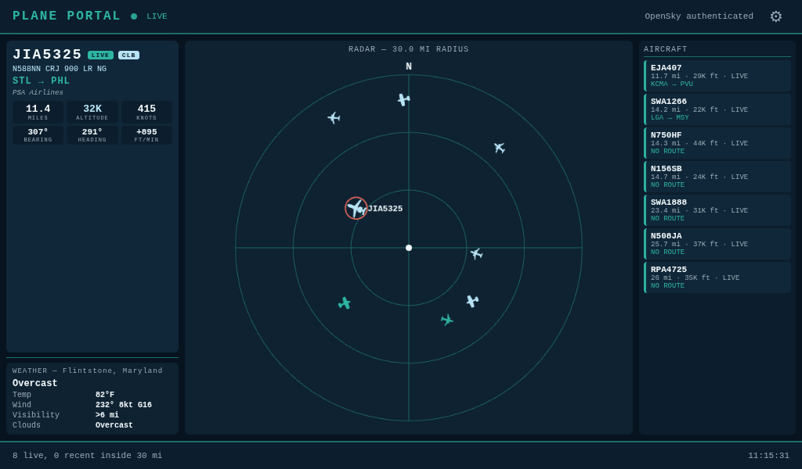

# Plane Portal Pi

Real-time aircraft tracking dashboard for Raspberry Pi with a 7" touchscreen display.



Ported from the original [PlanePortal](https://github.com/kevinl95/PlanePortal) CircuitPython project for Adafruit PyPortal. This version runs on a Raspberry Pi as a Flask web app displayed in fullscreen Chromium kiosk mode.

## What it does

- Polls OpenSky Network for live aircraft state vectors near a configured watch point
- Applies a true circular radius filter (default 3 miles)
- Keeps a rolling recent-aircraft memory so planes remain visible after passing through
- Enriches aircraft with ADSBDB metadata: registration, aircraft type, airline, and route
- Detects and highlights notable aircraft: military, helicopters, heavy/widebody, UAVs, and government
- Displays live weather conditions (temperature, wind, visibility, cloud cover) from Open-Meteo
- Renders an aviation-style dashboard with a live radar view, featured aircraft card, metrics, and a recent-traffic sidebar
- On-screen settings panel with built-in touch keyboard — no physical keyboard needed
- Auto-refreshes via AJAX — no page reloads needed

## What the screen shows

- **Header**: app title, live/stale status indicator, data source, settings gear
- **Featured aircraft** (left): callsign, type, route, operator, distance, altitude, speed, heading, vertical rate, climb/descent trend, and notable badge
- **Weather** (left, below featured): current conditions with location name — temperature, wind, visibility, cloud cover (shown as aviation terms: Clear/Few/Scattered/Broken/Overcast)
- **Radar** (center): aircraft plotted by bearing and distance, color-coded by altitude; notable aircraft shown as diamonds with labels; tap any dot to select it
- **Aircraft list** (right): scrollable list of all tracked aircraft — tap any card to view its full details
- **Footer**: live/recent counts and status notes

### Touch interaction

Tap any aircraft dot on the radar or any card in the aircraft list to view its full details in the featured panel. Tap "TAP TO DESELECT" or tap the same item again to return to the default view (closest aircraft featured). The aircraft list is scrollable by swiping.

Tap the gear icon in the header to open the settings panel. All settings can be edited with the built-in on-screen keyboard — no physical keyboard required. Saving writes to `.env` and restarts the service automatically.

### Notable aircraft

Military, government, helicopters, heavy/widebody jets, and UAVs are automatically detected and highlighted with a pulsing badge and diamond radar marker.

| Tag | Trigger | Radar color |
|-----|---------|-------------|
| MILITARY | Military callsigns, owners, or types (C-17, F-16, etc.) | Red |
| HELO | Rotorcraft | Yellow |
| HEAVY | Heavy/widebody aircraft | Light blue |
| UAV | Drones | Red |
| GOV | Government / law enforcement | Yellow |

### Altitude color coding

| Color | Altitude |
|-------|----------|
| Orange | Below 12,000 ft |
| Teal | 12,000 - 28,000 ft |
| Light blue | Above 28,000 ft |

## Hardware needed

- Raspberry Pi (3B+, 4, 5, or Zero 2W)
- 7" display — the official Raspberry Pi touchscreen (800x480) or any HDMI display
- WiFi or Ethernet connection
- SD card with Raspberry Pi OS (Desktop edition)

No GPIO wiring, no special hardware. Just power, display, and network.

## Quick start

### 1. Clone and set up

```bash
git clone https://github.com/tshipway1/PlanePortal-Pi.git
cd PlanePortal-Pi
chmod +x setup-pi.sh
./setup-pi.sh
```

The setup script:
- Installs system packages (Python 3, Chromium, unclutter) — auto-detects the correct Chromium package for your Pi OS version
- Creates a Python virtual environment and installs dependencies
- Generates a `.env` config file if one doesn't exist
- Installs a systemd service (`planeportal.service`)
- Configures Chromium kiosk-mode autostart

### 2. Configure

Edit `.env` with your location and (optionally) OpenSky credentials:

```bash
nano .env
```

Required settings:

- `PLANEPORTAL_HOME_LATITUDE` — your watch-point latitude (decimal degrees)
- `PLANEPORTAL_HOME_LONGITUDE` — your watch-point longitude (decimal degrees)

Recommended:

- `OPENSKY_CLIENT_ID` — OpenSky Network API client ID
- `OPENSKY_CLIENT_SECRET` — OpenSky Network API client secret

Register for free at [opensky-network.org](https://opensky-network.org/) for higher rate limits.

Optional settings (with defaults):

| Setting | Default | Description |
|---------|---------|-------------|
| `PLANEPORTAL_RADIUS_MILES` | 3 | Search radius in miles |
| `PLANEPORTAL_REFRESH_SECONDS` | 120 | Seconds between API polls |
| `PLANEPORTAL_RECENT_WINDOW_MINUTES` | 10 | How long to remember aircraft |
| `PLANEPORTAL_ENRICHMENT_LIMIT` | 4 | Max aircraft to enrich per cycle |
| `PLANEPORTAL_ADSB_CACHE_SECONDS` | 1800 | Metadata cache TTL |
| `PORT` | 5000 | Web server port |

### 3. Start

```bash
# Start the service
sudo systemctl start planeportal

# Check status
sudo systemctl status planeportal

# View logs
journalctl -u planeportal -f
```

Open `http://localhost:5000` in a browser, or reboot the Pi for automatic kiosk-mode display.

To launch Chromium on the Pi's screen from an SSH session:

```bash
DISPLAY=:0 chromium --kiosk --incognito http://localhost:5000
```

### Manual run (without systemd)

```bash
source venv/bin/activate
python run.py
```

## Architecture

```
run.py                  <- Entry point: loads .env, starts Flask
app/
  server.py             <- Flask app, background fetch loop, JSON API, settings API
  config.py             <- Reads settings from environment variables
  opensky_client.py     <- OpenSky OAuth2 + state vector fetching
  adsbdb_client.py      <- Aircraft metadata enrichment + caching
  tracker.py            <- Radius filtering, distance math, flight registry
  weather_client.py     <- Open-Meteo weather conditions (no API key needed)
templates/
  dashboard.html        <- Full dashboard UI (HTML + CSS + JS + Canvas)
setup-pi.sh             <- One-step Pi installer
```

The app runs a Flask web server with a background thread that periodically polls the OpenSky Network API. The frontend is a single HTML page that polls a `/api/snapshot` JSON endpoint every 5 seconds and renders everything client-side with vanilla JavaScript and Canvas.

### Data sources

- **OpenSky Network** — live aircraft positions, altitude, speed, heading, vertical rate
- **ADSBDB** — aircraft registration, type, route, airline, operator (best-effort)
- **Open-Meteo** — current weather conditions (free, no API key required)
- **OpenStreetMap Nominatim** — reverse geocoding for weather location name

## Troubleshooting

**No aircraft showing up?**
- Verify your latitude/longitude in `.env` are correct
- Try increasing `PLANEPORTAL_RADIUS_MILES` to 10 or higher
- Check that OpenSky API is reachable: `curl https://opensky-network.org/api/states/all?lamin=47&lomin=-123&lamax=48&lomax=-122`

**Rate limited?**
- Register for OpenSky API credentials (free) and add them to `.env`
- Increase `PLANEPORTAL_REFRESH_SECONDS` to 180 or higher

**Screen not filling the display?**
- The dashboard uses viewport-relative sizing and should fill any screen
- If using HDMI, check `/boot/config.txt` display settings match your panel resolution

**Chromium won't install?**
- The setup script auto-detects the correct package name (`chromium` on Bookworm+, `chromium-browser` on older Pi OS)

**Chromium asks to unlock keyring on boot?**
- The kiosk autostart uses `--password-store=basic` to skip the GNOME keyring prompt
- If you set up kiosk mode manually, add that flag to your Chromium command

## Credits

Based on [PlanePortal](https://github.com/kevinl95/PlanePortal) by Kevin Loughlin.
